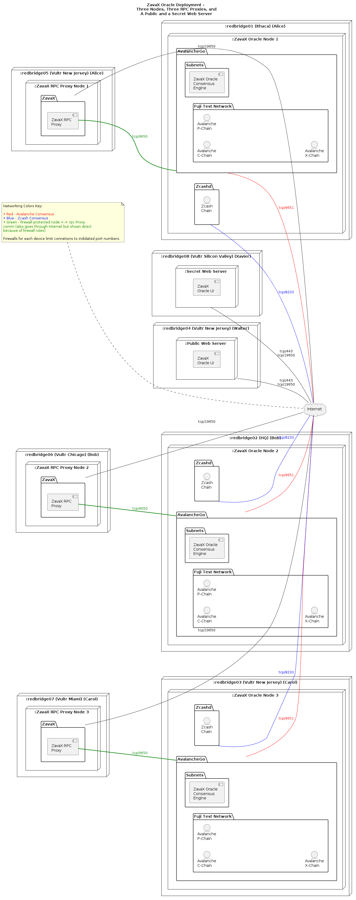
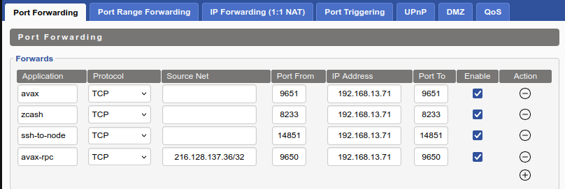
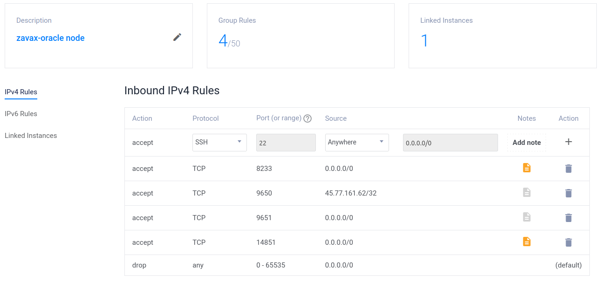
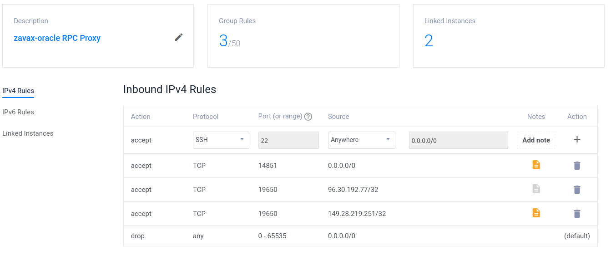
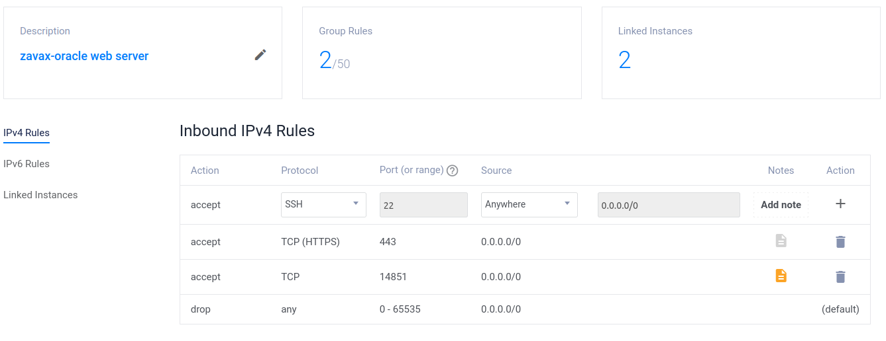

 # Configuration Notes for Nodes, RPC Proxies, Web Servers, and Firewalls
 Here is a diagram showing the current ZavaX Oracle platform topology, excluding firewalls. The notes in this document elaborate on this diagram.


## TCP Port Usage
Here is how TCP ports are used in the ZavaX Oracle platform.
- **443** - HTTPS for web servers.
- **8233** - Zcashd node peer-to-peer communication.
- **9650** - Unprotected Avalanchego RPC port.
- **9651** - Avalanchego node peer-to-peer communication.
- **14851** - Non-standard port for SSH, requires private key.
- **19650** - Proxied Avalanchego RPC port, protected by OpenResty and firewalls.
## Node Configuration
Node 1 and Node 2 are behind NAT firewalls, so firewall forwards inbound connections to 9650 only from allowed RPC proxies. For redundancy/layering, UFW also protects 9650 similarly. Node 3 is behind a non-NAT firewall that restricts inbound TCP traffic on 9650 to only allowed RPC proxies and also uses UFW.

Allow 9651 ports inbound connections for Avalanchego node p2p comm.

Allow 8233 ports inbound connections for Zcashd node p2p comm.

## RPC Proxy Configuration
Install and configure [OpenResty](https://OpenResty.org/en/) to protect 19650 connections as we are doing now with metering, and employ [JSON filtering using lua](https://github.com/adetante/ethereum-nginx-proxy). Example:

```
...
    server {
                        listen 19650 ssl;
                        server_name zavax-node1-proxy.red.dev;
                        ssl_certificate /usr/local/OpenResty/nginx/ssl/cert.pem;
                        ssl_certificate_key /usr/local/OpenResty/nginx/ssl/privkey.pem;

                        location / {
                                        #limits
                                        limit_conn conn_limit_per_ip 10;
                                        limit_req zone=req_limit_per_ip burst=5 nodelay;
                                        limit_rate 10k;

                                        #filter
                                        set $jsonrpc_whitelist 'zavax.getBlockByHeight,zavax.getBlock,zavax.reconcileBlocks,info.isBootstrapped';
                                        access_by_lua_file 'eth-jsonrpc-access.lua';

                                        #redirect
                                        proxy_pass https://zavax-node1.red.dev:9650;
                        }
        }

...
```


### Config 1 (tight, Node 1 and 2)
Only allow 19650 ports (rpc forwarded ports) inbound connections from only Public web server and Secret web server.

### Config 2 (more open, Node 3) Allow all outbound connections
Allow 19650 ports (rpc forwarded ports) inbound connections with any computer

## Web Servers Configuration
### Secret Web Server (tight)
Use standard Vultr firewall and UFW to only allow 443 access. Use OpenResty to protect against standard DoS attacks. Only allow 443 access from our test workstations. 

### Public Web Server
Use standard Vultr firewall and UFW to only allow 443 access. Use Openresty to protect against standard DoS attacks. 

## Configurations of Firewalls
Strategy: Employ a two-layer firewall implementation to mitigate human error, an external firewall to handle most of the load, and a server-based UFW firewall for redundancy and to limit outbound traffic.

Note: UFW is used instead of straight IPTABLES for simplicity and to reduce the chance of human error.

All Nodes, RPC Proxies, and Web Servers employ this strategy. Details are described below.

### Firewalls for ZavaX Nodes

#### UFW Example

*Permit inbound TCP connections on ports 9651 and 8233 from any source, while restricting access on port 9650 exclusively to a host named [redbridgeRpcProxyServer]. Additionally, this host should facilitate apt updates and upgrades, and accept SSH connections on TCP port 14851*

```# Default policies
ufw default deny incoming
ufw default deny outgoing

# Allow inbound TCP on ports 9651 and 8233 from anywhere
ufw allow in 9651/tcp
ufw allow in 8233/tcp

# Allow inbound TCP on port 9650 only from the host with a specific name or IP
# (add IP and uncomment:)
# ufw allow in from [redbridgeRpcProxyServer_IP] to any port 9650 proto tcp

# Allow SSH connections on TCP port 14851 from anywhere
ufw allow in 14851/tcp

# Allow Ubuntu apt updates and upgrades
ufw allow out 80/tcp
ufw allow out 443/tcp
# Allow 22/tcp out for typical outgoing SSH connections, for instance, to a firewall.
# ufw allow out 22/tcp

# Allow zcashd and avalanchego to initiate connections with other nodes
ufw allow out 8233/tcp
ufw allow out 9651/tcp

# Allow outbound DNS queries over both TCP and UDP
ufw allow out to any port 53 proto tcp
ufw allow out to any port 53 proto udp

# Allow outbound connections from unprivileged TCP ports
ufw allow out to any port 1024:65535 proto tcp

```
#### dd-WRT Example


#### Vultr Example


### Firewalls for RPC Proxy Servers

#### UFW Example

UFW should allow inbound TCP on these ports 19650, 14851 from anywhere. Allow replies to established or related connections. Allow ubuntu apt updates and upgrades. Drop everything else.

```# Default policies
ufw default deny incoming
ufw default deny outgoing

# Allow inbound TCP on ports 19650 and 14851 from anywhere
# (Or replace with this alternative command to restrict access to just the webserver # (add IP and uncomment):)
# ufw allow in [zavax-oracle webserver] port 19650 proto tcp
ufw allow in 19650/tcp

# Allow inbound SSH on custom port 14851
ufw allow in 14851/tcp

# Allow replies to established or related connections
# UFW handles this automatically with the default policy for established/related incoming traffic

# Allow outbound connections on port 9650 to IP address zavax-nodeX ip address
# (add IP and uncomment:)
# ufw allow out to  [zavax-nodeX ip address] port 9650 proto tcp

# Allow Ubuntu apt updates and upgrades (typically requires HTTP and HTTPS)
ufw allow out 80/tcp
ufw allow out 443/tcp

# Allow outbound DNS queries over both TCP and UDP
ufw allow out to any port 53 proto tcp
ufw allow out to any port 53 proto udp

```

#### Vultr Example

This firewall allows only web servers at 96.30.192.77 and 149.28.219.251 to use the RPC Proxy Server. To enable anyone to use the RPC Proxy Server, remove the lines:
```
accept  TCP 19650 96.30.192.77/32
accept  TCP 19650 149.28.219.251/32
```
and add this line instead:
```
accept  TCP 19650 0.0.0.0/0
```

### Firewalls for Web Servers
#### UFW Example

*Internal: ufw allow inbound TCP on these ports 443 from anywhere. Allow replies to established or related connections. Drop everything else.*

```# Default policies
ufw default deny incoming
ufw default deny outgoing

# Allow inbound SSH on custom port 14851
ufw allow in on eth0 to any port 14851 proto tcp

# Allow inbound HTTPS on port 443
ufw allow in on eth0 to any port 443 proto tcp

# Allow outbound to specific host on port 19650
# (add IP and uncomment:)
# ufw allow out on eth0 to [redbridgeRPCProxyServer] port 19650 proto tcp

# Allow outbound HTTP and HTTPS for package management and updates
ufw allow out on eth0 to any port 80 proto tcp
ufw allow out on eth0 to any port 443 proto tcp

# Allow outbound DNS queries over both TCP and UDP
ufw allow out to any port 53 proto tcp
ufw allow out to any port 53 proto udp

# Optional: Enable logging for debugging
ufw logging on

```

#### Vultr Example


## Possible Future Enhancements

These enhancements would further harden the ZavaX Oracle platform.

### SSH
Secure SSH with Fail2Ban
https://security.stackexchange.com/questions/55419/harden-a-server-against-mass-ssh-dos-attacks

### Server Monitoring

Add server monitoring software such as https://mmonit.com/monit/

### Diversify VPS Hosting
Move servers *redbridge06*, *redbridge07*, and *redbridge08* to VPS cloud providers besides Vultr.


