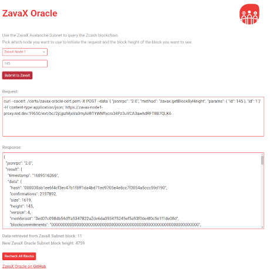
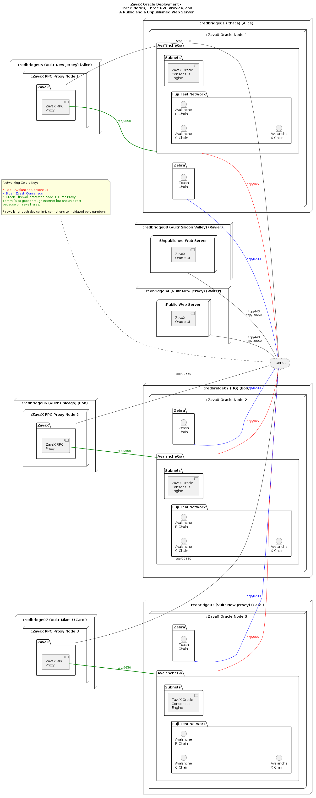

 # ZavaX Oracle Threat Model
 
 This threat model is based upon the [Invariant-Centric Threat Modeling](https://github.com/defuse/ictm) methodology which focuses the discussion on what remains true about the integrity of the system when placed under various threat scenarios.

 The ZavaX Oracle is a proof-of-concept for the ZavaX Bridge. As such, many findings here can be applied toward improving the security of the ZavaX Bridge, and ultimately, that is the purpose of this threat model.

## Target Audience

The target audience of this threat model are software security auditors and others who think about blockchain and distributed systems security.

## Participants and Adversaries

### Participants

Participants **Alice**, **Bob**, and **Carol** each control one ZavaX Oracle node and an associated RPC proxy server. Alice owns node 1, Bob node 2, and Carol node 3.  

**Oscar** would like to use the ZavaX platform to find out the contents of a Zcash block at a particular block height.

**Walter** operates the web server that publicly hosts the ZavaX Oracle UI. **Xavier** operates a secret web server that can be used in place of Walter's in times of attack by adversaries.  Alice and Bob only allow RPC requests from Walter's and Xavier's web servers. Carol allows RPC requests from anywhere on the Internet, for instance by Oscar using the linux *curl* command on his home computer.

Participant **Red** created the ZavaX Oracle permissioned L1 and holds private keys that allow the addition and removal of nodes and other parameter changes.

### Adversaries

Adversary **Eve** has the ability to monitor communications on the Internet.

Adversary **Mallory** can commandeer root control of some amount of nodes from Alice, Bob, and/or Carol due to their poor op-sec.

Adversary **Trudy** can commandeer root control of Walter's web server but is unaware of Xavier's.

Adversary **Dave** has a botnet big enough to perform a substantial DDoS attack on blockchain nodes, RPC proxy servers, web servers, etc.

Adversary **Sybil** has many Zcash mining rigs that have been offline and now are about to be repurposed to cause a chain split that introduces fake transactions and has enough electricity available to sustain this attack for up to sixty minutes.

## Overview of ZavaX Oracle Under Normal Operations

The [ZavaX Oracle](https://zavax-oracle.red.dev) is a permissioned Avalanche L1 operating on the Avalanche Fuji Test Network. Its purpose is to serve as an oracle of blocks written to the Zcash mainnet chain, reaching consensus and recording these in its own chain. Here is what the website UI looks like:

Under normal operations, Oscar can query a Zcash block height using any of the RPC proxy server nodes on the ZavaX Oracle platform using Walter's [website](https://zavax-oracle.red.dev).
- If the contents of the Zcash block at the block height has already been written to the ZavaX chain, it is displayed.
- If it has not yet been written to the ZavaX chain, nodes 1, 2, and 3 reach consensus with each other about the contents of the block, write it to the ZavaX chain by querying their own Zcashd daemon, and then the contents is displayed. 
- Nodes reach consensus by weighted voting:
- - **Node 1 has a weight of 50 (41.7% of the total weight)**
- - **Node 2 has a weight of 40 (33.3% of the total weight)**
- - **Node 3 has a weight of 30 (25.0% of the total weight)**
- If the block height does not exist yet, is invalid, or is still less than 24 blocks deep, an error message is displayed.

In addition, Oscar may send *curl* commands to query a block height as shown in the web UI to Carol's RPC proxy server (the only RPC proxy server configured to allow RPC requests from anywhere) and a response is returned, following the same rules. Walter's website displays valid *curl* commands in the **Request** section.

## The ZavaX Oracle Platform

This platform diagram shows ZavaX Oracle's three nodes with their associated RPC proxys (operated by Alice, Bob, and Carol) and two web servers (operated by Walter and Xavier), and the connections between them. It omits showing firewalls, but in fact, each host is protected by both host-based and external firewalls, explained elsewhere.

This is a tiny Avalanche L1 with only three nodes. As such, it is well-suited to illustrate worst-case threat model scenarios that we will encounter with our next more complex project, the bridge.

One can see that all of these attacks' feasibility and impact are mitigated—often by orders of magnitude—*by increasing the size of the network and distribution of stake.* Indeed, in the production version of the bridge, the network will be much larger. (Version 1.0 of the ZavaX Bridge will accommodate up to 1000 nodes.)

The ZavaX Oracle is also a permissioned blockchain, and this will not be the case for the bridge, which will be permissionless, further hardening the platform in some key ways. There will be no private key that can add and remove nodes, for instance.

Finally, it's worth noting that in all but one of the scenarios described here, no bad data can be written to the ZavaX Oracle blockchain. Indeed, only under **the most severe attack** where 
- many nodes, under the control of multiple parties, 
- handling together greater than 67% of stake, 
- are commandeered due to lax op-sec, 

is it possible to actually write bad oracle data to the blockchain. Even in this extreme case, the blockchain can be reclaimed by its rightful operators within 24 hours.

Now let's dive into the threat model scenarios, security invariants, known weaknesses, and mitigations.

## Usage Scenario: Normal Operations with Monitoring

Eve is monitoring all network traffic between all devices in the ZavaX Oracle platform, all Zcash nodes, and Avalanche nodes. In other words, the Internet is functionally normally.

### Security Invariants

Even with complete monitoring, the ZavaX Oracle platform will operate normally. 

All connections except for zcashd-zcashd connections are performed over TLS with a certificate issued by [Let's Encrypt](https://letsencrypt.org) and are therefore secure from Eve's snooping to the extent that this configuration provides. The TLS private key is stored in a non-public location on the servers; the public key is available to all.

### Known Weaknesses

If Oscar were to perform many queries in a short time--for instance by running automation software--some queries would fail due to rate limits imposed by the RPC Proxy nodes.

Also, Oscar cannot use *curl* to query nodes 1 and 2 due to the security preferences that Alice and Bob have chosen to use for their RPC nodes. Carol's node 3 is configured for rate-limited *curl* use by anyone, however.

### Mitigations

None necessary.

## Usage Scenario: Mallory gains root access to Carol's Infrastructure

### Security Invariants

#### Blockchain functionality preserved for other nodes
Alice and Bob's nodes 2 and 3 continue to function normally, acting as oracles for already-minted data and correctly minting new oracle data to the ZavaX Oracle chain. This is because together, Bob and Clara control 75% of stake, greater than the 67% needed.

ZavaX Oracle, as a test/PoC network, only has three nodes, but if it had more, all the rest of the other nodes would also continue to function normally.

### Known Weaknesses

This is a **serious attack**. In this usage scenario, Mallory will be able to provide incorrect results to Oscar's web server when the web server submits a query to Carol's RPC proxy 3 for any block. 

### Mitigations

This problem is mitigated by Oscar's opportunity to easily query other RPC proxies and compare the results. Since all should return exactly the same results, but in this case only two out of three do, it would be easy for Oscar to:

1. Know that some part of the platform was compromised 
2. Guess that probably Node 3 was compromised (since results from 1 and 2 would match), and 
3. Notify node owners Alice, Bob, and Carol. 
 
Carol could then take action to regain control over her infrastructure. Since ZavaX Oracle is permissioned, this would have to be coordinated with the blockchain creator, Red. However, in the future, the blockchain will be permissionless, and it will simply be a matter of Carol unstaking her ZAX tokens on the node 1 hardware, spinning up a new node 4 and a RPC proxy server for node 4, and staking her tokens there. This would remove node 1 from the network within 24 hours. Then, she would have to coordinate with Walter and Xavier so that the web servers could connect to her new node's RPC proxy.

This scenario can be prevented in the first place by implementing normal server op-sec, with Carol keeping her SSH private keys secure and password-protected, by Carol configuring firewalls to only allow logins from a narrow range of IP addresses, and so on.

## Usage Scenario: Mallory gains root access to both Bob's and Carol's ZavaX Infrastructure

### Security Invariants

Querying Alice's node for data in already-mined blocks will produce correct results. Inconsistent results from Alice's node in comparison to those from Bob's and Carol's would indicate to Walter that the ZavaX platform is under attack and compromised.

### Known Weaknesses

This is a **severe attack**, with 58.3% of stake is controlled by an attacker. Because the 67% threshold to mint new blocks has not been reached, no new blocks with incorrect data can be minted. However, Bob's and Carol's RPC servers can make it *appear* to Walter's web server that new blocks have been minted and can provide incorrect data. Still, Alice's RPC server would produce conflicting results, indicating to Oscar that there's a problem.

### Mitigations

Bob and Carol can regain control of their servers in the same way as in the scenario above within 24 hours, and the scenario can be prevented from happening by using the same methods.

## Usage Scenario: Mallory gains root access to both Alice's and Bob's ZavaX infrastructure

### Security Invariants

Querying Carol's node for data in already-mined blocks will produce correct results. Inconsistent results from Carol's node in comparison to those from Alice's and Bob's would indicate to Walter that the ZavaX Oracle platform is under attack and compromised. 

### Known Weaknesses

This is **the most severe attack**, with 75% of stake is controlled by an attacker. Because the 67% threshold to mint new blocks has been reached, new blocks with incorrect data can be minted, leaving Carol's node no choice but to agree to add the incorrect data.

### Mitigations

Alice and Bob can however regain control of their servers in the same way as in the scenarios above within 24 hours, and the scenario can be prevented from happening by using the same methods.

## Usage Scenario: Trudy gains root access to Walter's web server that runs the ZavaX UI

### Security Invariants

While Walter's web server could produce incorrect results, Xavier's secret web server would remain functioning well, as would **curl** commands to Carol's RPC node.

### Known Weaknesses

There would be no indication of Walter's web server malfunctioning without running a cross-check.

### Mitigations

Verify data by using Xavier's web server.

## Usage Scenario: Dave attempts to perform a DDoS attack against one, two, or three RPC proxy severs

### Security Invariants

The nodes would keep working, reaching consensus and minting new blocks. Other RPC proxy servers, if allowed by the nodes' firewalls, would remain online.

Because almost all of the load for the attack would be handled by the server's external firewall and openresty filtering, the proxy service itself would remain operating and could be configured to provide services through hidden channels that were not under attack.

Cloud service providers such as Vultr provide additional DDoS counter-measures for an additional charge which could be turned on.

### Known Weaknesses

If all RPC nodes are sucessfully attacked at once, Walter's web server would be unable to function as an oracle.

### Mitigations

This weakness is mitigated by running more RPC proxy servers, increasing the cost of the attack linearly.

## Usage Scenario: Dave attempts to perform a DDoS attack against one, two, or three ZavaX nodes

### Security Invariants

The nodes would keep functioning internally but could be blocked from reaching consensus and minting new blocks. RPC proxy servers would not be able to communicate with their nodes.

Because almost all of the load for the attack would be handled by the node's external firewall, the node itself would remain operating and could be configured to connect with other nodes through hidden channels that were not under attack.

## Known Weaknesses

If all RPC nodes are sucessfully attacked at once, Walter's web server would be unable to function as an oracle.

### Mitigations

This weakness is mitigated by running more nodes, greatly increasing the cost of the attack.

Cloud service providers such as Vultr provide additional DDoS counter-measures for an additional charge which could be turned on.

## Usage Scenario: Dave attempts to perform a DDoS attack against Walter's web server.

### Security Invariants

Because almost all of the load for the attack would be handled by the server's external firewall and openresty filtering, depending on the severity of the attack, the web server may continue to function normally.

All RPC proxy servers and nodes remain operating normally. Xavier's secret web server also remains operating normally.

### Known Weaknesses

Once Xavier's web server's address is published, it could be a target for attack as well. 

### Mitigations

These attacks could be mitigated through bringing additional web servers online and adding more DDoS counter-measures such as the DDoS protection offered by Vultr.

## Usage Scenario: Sybil attempts to cause a Zcash chain split that includes all three ZavaX nodes for one hour

### Security Invariants

Because the ZavaX Oracle will not include a Zcash block until it is over 24 blocks deep, during the first ~29 minutes of this attack, the ZavaX Oracle would operate normally.  

### Known Weaknesses

After ~29 minutes, the ZavaX blockchain would be in danger of reporting bad data.  

### Mitigations

During that initial ~29 minutes, through monitoring of the Zcash blockchain, this attack would be detected, giving ZavaX node operators Alice, Bob, and Carol time to temporarily manually halt ZavaX block production until after the Zcash chain split has resolved. The RPC proxy servers, Walter's and Xavier's web servers would all be able to report on Zcash blocks already written the ZavaX chain.New blocks could not be reported until ZavaX block production resumes.

## Usage Scenario: Red's private keys for administering the permissioned ZavaX Oracle L1 are stolen

### Invariants and Known Weakness

This would be a catastrophic failure of the platform (but read on!). 

### Mitigations

The platform and its blockchain could easily be rebuilt within a week, the limiting step being the initial synchronization of a new instance of Zcashd with the Zcash blockchain. No data would be lost. Assuming Alice, Bob, Carol, Walter, and Xavier did not also lose control of their infrastructure, their web servers, proxy servers, and nodes could be brought down and/or rebuilt in an orderly fashion. New blocks could not be reported until ZavaX block production resumes.

### Removal of This Scenario from the Threat Model

We are actually not concerned about this scenario at all because the bridge will be a *permissionless* L1 and as such will not have any private keys that control the entire L1 to steal; nodes enter simply by staking ZAX to join and can leave just as easily.

## Summary

The ZavaX Oracle platform can be attacked in a number of ways, and as a three-node L1, it is especially vulnerable. One can see that all of these attacks' feasibility and impact are mitigated, sometimes by orders of magnitude, *by just increasing the size of the network.* In the actual production version of the ZavaX Bridge, the network will be much larger. Shifting from a *permissioned* to a *permissionless* L1 further secures the platform.

Also, only under **the most severe attack** where many nodes, handling together greater than 67% of stake (which will be raised to 80% for ZavaX Bridge), are commandeered due to lax op-sec, is it possible to actually write bad oracle data to the blockchain. In every other case, no bad data can be written, and even in this extreme case, the blockchain can be reclaimed by its rightful operators within 24 hours.

